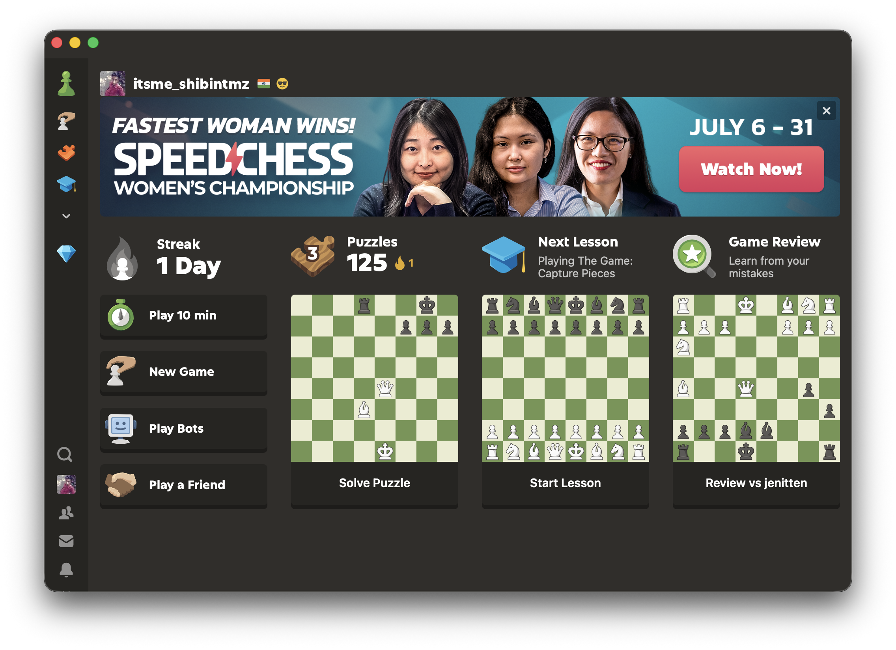
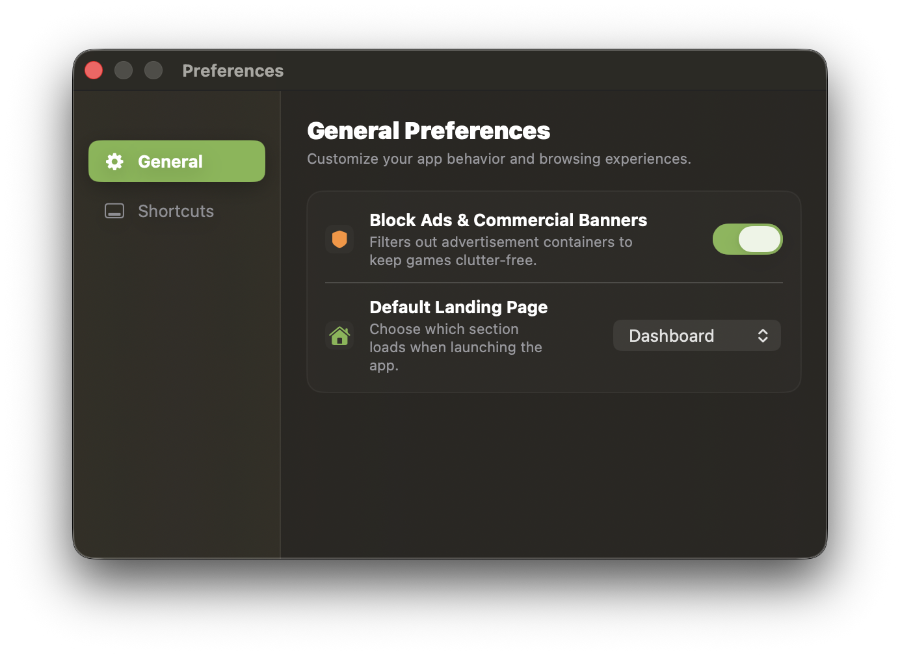
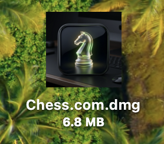

# Chess.com macOS Application

A beautiful, native-feel macOS desktop app for playing on **Chess.com**. Built with macOS design guidelines in mind, this app features smooth window effects, a custom navigation pill dock, and a built-in ad-blocker.

---

## 📸 Screenshots

| Main Chess App View | Preferences (⌘,) | Custom DMG Installer |
| :---: | :---: | :---: |
|  |  |  |

---

## 🚀 How to Install & Play (For Everyone)

Since Chess.com doesn't offer a official macOS app, you can install this desktop client in two simple steps:

### 1. Download the App
* Go to the **[Releases](https://github.com/itsmeshibintmz/chess.com-mac/releases)** section on the right side of the GitHub page.
* Download the latest **`Chess.com.dmg`** installer file. (Alternatively, if you run the developer build script locally, the installer will automatically be generated in your **Downloads** folder).

### 2. Install on your Mac
* Open the downloaded **`Chess.com.dmg`** file.
* Drag the **Chess.com** icon into your **Applications** folder.
* Launch it from your Applications folder or Launchpad!

*Note: Since this is a personal app built locally, your Mac might show a "blocked from opening because it is not from an identified developer" warning on first launch. To open it, simply right-click (or Control-click) the app icon in your Applications folder and select **Open**, then click **Open** again in the dialog.*

---

## ✨ Features

*   **Floating Navigation Pill**: A modern controls capsule bar that floats at the bottom center of the screen. It slides up when you move your mouse and auto-hides when you are playing so it never gets in the way.
*   **Built-in Ad-Blocker**: Includes an ad-blocker designed to hide advertisement banners and side commercial panels on Chess.com for cleaner boards. You can toggle this on or off instantly using the **Shield** icon on the navigation pill.
*   **Quick Shortcuts**: The bottom pill has buttons to take you instantly to:
    *   **Play Online** 🎮
    *   **Puzzles** 🧩
    *   **vs. Computer** 💻
    *   **Lessons** 🎓
*   **Custom Preferences (⌘,)**: Customize which shortcut buttons appear in the pill and choose which page loads automatically when the app starts.
*   **Google & Facebook Login Support**: Built-in support to allow logging into your Chess.com account securely with your Google, Apple, or Facebook profiles.

---

## 🛠️ How to Compile (For Developers)

If you want to build the application from scratch using Xcode:

### Requirements
*   macOS 13.0 or higher
*   Xcode 15.0 or higher
*   `create-dmg` (optional, for installer packaging)

### Steps
1. Clone the repository:
   ```bash
   git clone https://github.com/itsmeshibintmz/chess.com-mac.git
   cd chess.com-mac
   ```
2. Open `ChessMac.xcodeproj` in Xcode and click **Run**.

### Creating the DMG Installer
To build a release installer like the one in the Releases section, run:
```bash
./build_dmg.sh
```
This script will build a clean Release build and output the final **`Chess.com.dmg`** file directly to your **Downloads** folder.

---

## 🤝 Disclaimer

This project is a personal utility. It is not affiliated, associated, authorized, endorsed by, or in any way officially connected with Chess.com.
